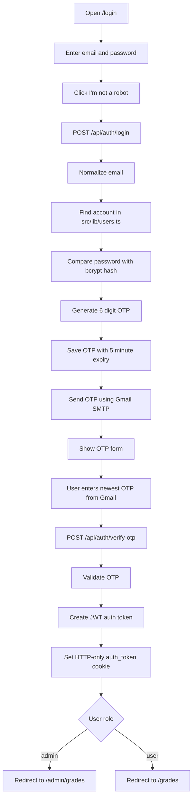
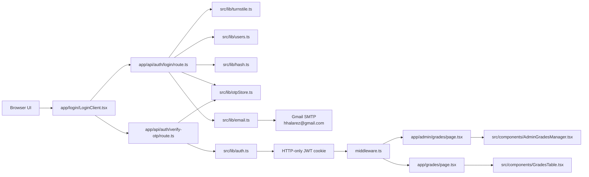
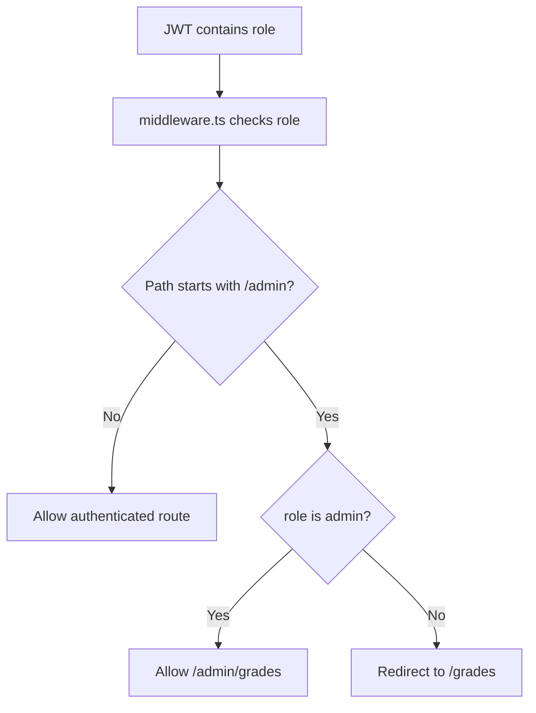
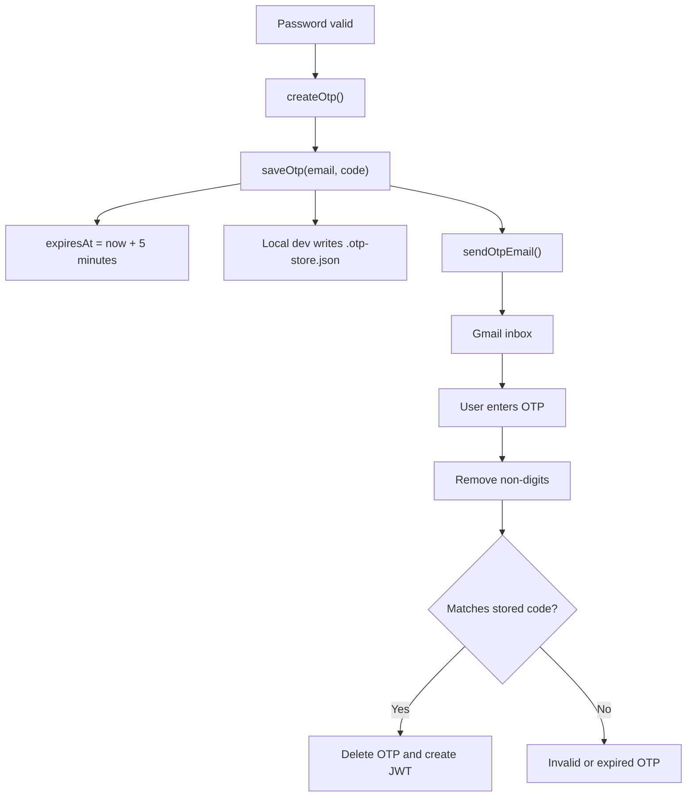

# Updated Project Architecture

## Current Accounts

```text
Admin 1
Email: halarez123@gmail.com
Password: Tala@890
Role: admin
Dashboard: /admin/grades

Admin 2 / Gmail Sender
Email: hhalarez@gmail.com
Password: Rezt06200
Role: admin
Dashboard: /admin/grades
SMTP sender: hhalarez@gmail.com
```

Both configured accounts are admin accounts. After successful OTP verification, both redirect to the admin dashboard.

## Authentication Flow



## System Architecture



## Role Architecture



## OTP Architecture



## Important Files

```text
app/login/LoginClient.tsx
app/api/auth/login/route.ts
app/api/auth/verify-otp/route.ts
app/api/auth/logout/route.ts
app/admin/grades/page.tsx
app/grades/page.tsx
middleware.ts

src/lib/users.ts
src/lib/hash.ts
src/lib/auth.ts
src/lib/otpStore.ts
src/lib/email.ts
src/lib/turnstile.ts

src/components/AdminGradesManager.tsx
src/components/GradesTable.tsx
src/components/LogoutButton.tsx
```
